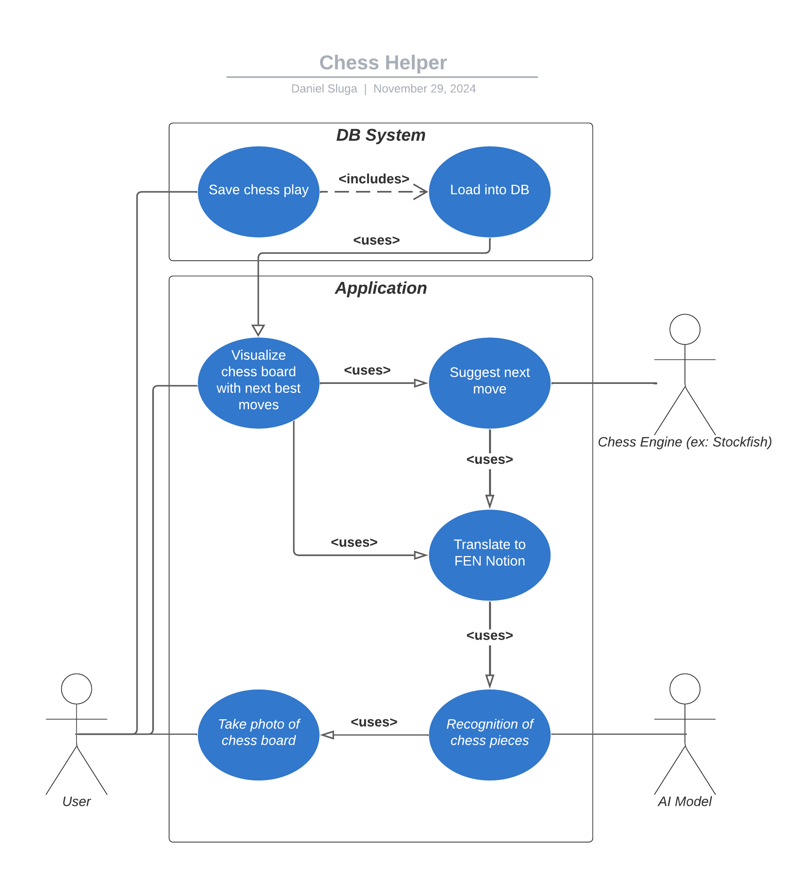

# Chessboard Recognition System Requirements

## 1. General Requirements
- Users can take a photo of a chessboard.
- The system will recognize the board and piece positions from the photo.
- Recognized positions will be converted into FEN (Forsyth-Edwards Notation).
- FEN notation will be sent to a chess engine to suggest the best move.
- Suggested moves and the board state will be displayed in a user-friendly interface.
- Chess games can be saved and loaded from a database.
- The system will work on both Android and iOS.

## 2. Functional Requirements

### Image Processing
- Capture chessboard images using the device camera.
- Detect the chessboard and pieces in the image.
- Adjust for lighting conditions and camera angles for better accuracy.

### Chessboard and Piece Recognition
- Identify standard chessboard patterns and dimensions.
- Distinguish pieces by type (e.g., pawn, knight) and color (black or white).

### FEN Conversion
- Convert the recognized board state into valid FEN notation.

### Chess Engine Integration
- Use the Stockfish engine to suggest the best moves based on FEN.
- Support lighter engines for local processing if needed.

### User Interface
- Display the chessboard and recommended moves visually.
- Highlight potential opponent moves after each user move.
- Include undo/redo functionality for move history.
- Allow manual board state editing for corrections.

### Simulation
- Simulate standard 8x8 chessboards with accurate square dimensions and colors.
- Support for various piece designs to ensure variety.
- Simulate random or predefined board states, including opening, middle game, and endgame positions.
- Implement varied lighting conditions.
- Simulate camera views from different angles.

### Game Management
- Save chess games with unique IDs.
- Load previously saved games for review or continuation.

## 3. Non-Functional Requirements
- Achieve at least 90% image recognition accuracy.
- Process images and provide recommendations in under 2 seconds.
- Follow design guidelines for Android and iOS platforms.
- Handle various chessboard and piece designs consistently.

## 4. Data Requirements
- Use annotated datasets, including Roboflow and user-created datasets.
- Include diverse chessboard and piece designs for better generalization.
- Support dataset augmentation with tools like Pillow and Blender.

## 5. User and System Interactions

### User Goals
- Analyze chess games using board images.
- Receive next-move suggestions and win probabilities.
- Save, load, and review games easily.

### System Operations
- Analyze board images within 2 seconds.
- Clearly display the best move and possible opponent responses.

## 6. Challenges and Risk Mitigation

### Predicted Challenges
- **Board Recognition Accuracy**: Achieve >90% accuracy for unconventional designs.
- **Lighting Conditions**: Use preprocessing to handle poor lighting.
- **Special Rules**: Recognize en passant and castling in FEN conversion.

### Encountered Challenges
- TBD (as they arise).

## 7. Development Requirements

### Team Roles
- **Project Manager**: Ensure timely progress and schedule adherence.
- **Simulation Team**: Create annotated data with tools like Blender.
- **Computer Vision Team**: Develop the recognition module and train models.
- **Backend Team**: Handle chess engine integration and data storage.
- **Frontend Team**: Design and build the user interface.

### Performance Goals
- (TBD)

## 8. Verification and Validation

### Verification
- Test recognition accuracy with a diverse set of chessboard images.
- Ensure FEN notation is correct via chess engine compatibility checks.

### Validation
- Conduct usability tests with chess enthusiasts to refine the interface.
- Test game-saving features to confirm saved states match live games.

## 9. Use Case Diagramm

## Formale Use Case
| Field                | Description                                                                 |
|----------------------|-----------------------------------------------------------------------------|
| Goal                | User wants to get the next move suggestion by taking a photo of the chessboard with the app. |
| Primary Actor       | User                                                                        |
| Scope               | Piece recognition with computer vision and next move suggestion.           |
| Level               | User                                                                        |
| Precondition        | User takes a photo with the camera through the app.                        |
| Success End         | Chessboard is correctly detected, and the next move is suggested.          |
| Failure End         | Photo cannot be analyzed.                                                  |
| Trigger             | User takes a photo through the app.        

